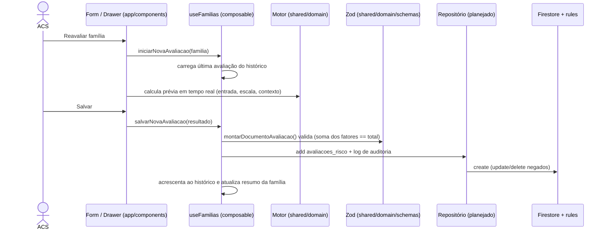

# Arquitetura de Software — PET-Saúde

Clean Architecture leve / DDD leve: o domínio (cálculo de risco e contratos de dados) fica isolado e testável; interface e persistência dependem dele, nunca o contrário.

---

## 1. Camadas e pastas

```text
shared/domain/                  ← DOMÍNIO — TypeScript puro, sem Vue nem Firebase
  risk-engine/
    types.ts                    enums e contratos (FaixaRisco, IndicadorRiscoCodigo…)
    constants.ts                escala versionada (pesos, cortes, metadados)
    calculadora.ts              motor determinístico calcularEstratificacaoRisco()
  schemas/index.ts              schemas Zod = contrato de persistência; montarDocumentoAvaliacao()

app/                            ← INTERFACE (Nuxt 4 / Vue 3.5)
  components/                   só apresentação; nenhum peso ou regra de cálculo
  composables/useFamilias.ts    estado da tela e orquestração do fluxo
  utils/estiloFaixaRisco.ts     faixa → cor/ícone/rótulo (único lugar)
  utils/iconesIndicador.ts      indicador → ícone
  utils/icones.ts               ícones gerais + exceções Lucide
  repositories/        (plan.)  adaptadores Firestore (familias, avaliacoes, logs)
  plugins/firebase.client.ts    inicialização do SDK Firebase

functions/             (plan.)  revalidação server-side (Zod) + LogAuditoria
firestore.rules                 RBAC territorial + invariantes de imutabilidade
tests/unit/                     Vitest — motor e schemas (sem emulador)
tests/rules/                    Vitest + Firestore Emulator — regras de acesso
```

`(plan.)` = planejado, ainda não implementado. Hoje os dados são sintéticos e ficam em memória no `useFamilias.ts`.

### Regra de dependência

- `app/` e `functions/` importam de `shared/domain/`.
- `shared/domain/` **não importa** nada de `app/`, `functions/`, Vue, Nuxt ou Firebase.
- Componentes não chamam o Firestore diretamente: usam composables, que usam repositórios.

---

## 2. Motor de estratificação

```ts
calcularEstratificacaoRisco(entrada, contexto, configuracao = CONFIGURACAO_COELHO_SAVASSI_V1): ResultadoEstratificacaoRisco
```

- `entrada`: família e indicadores presentes (com `individuoId` opcional) e a avaliação anterior, se houver.
- `contexto`: `{ dataAvaliacao, avaliadorId, avaliadorPerfil }`, **injetado** para o cálculo ser determinístico e auditável.
- `configuracao`: versão da escala (`ConfiguracaoEscalaRisco`), com pesos por indicador (`number` ou `null` = não pontuado), limites de corte e gatilhos diretos.
- Saída: pontuação, faixa, regra de decisão em texto, fatores determinantes, indicadores não pontuados, delta e autoria.

Regras detalhadas em [`business_rules.md`](./business_rules.md).

---

## 3. Fluxo de uma reavaliação



Hoje os passos `R` e `F` estão simulados em memória; o restante já segue este fluxo.

---

## 4. Decisões registradas

| Decisão | Motivo |
| :--- | :--- |
| Território denormalizado nos documentos | As regras do Firestore validam acesso sem joins; listagens filtram por território. |
| Papéis em custom claims, não em documentos | Impede autopromoção; só o backend atribui papel. |
| Avaliação guarda `individuoId`, não nome | Minimização LGPD; o nome é resolvido só para quem acessa o prontuário. |
| Data e avaliador injetados no motor | Determinismo (mesma entrada ⇒ mesmo resultado) e autoria auditável. |
| Indicador com `peso: null` | Permite coletar variáveis novas dos GATs sem inventar peso. |
| Health Icons como padrão | Ícones de saúde pública; mapas centrais mantêm UI consistente. |
