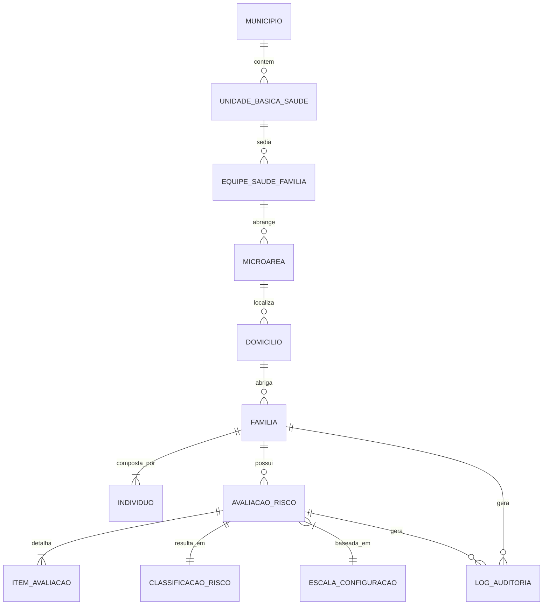

# Modelo de Domínio — PET-Saúde

Este documento define o modelo conceitual de entidades e invariantes de domínio do sistema de estratificação de risco na Atenção Primária à Saúde.

---

## 1. Visão Geral das Entidades e Relacionamentos

---

## 2. Dicionário de Entidades

### 2.1. `UnidadeBasicaSaude` (UBS)
Representa o estabelecimento de saúde do SUS onde as equipes estão alocadas.
- **Identificadores**: ID único, Código CNES (Cadastro Nacional de Estabelecimentos de Saúde), Nome da UBS, Município (e.g., Coxim ou Corumbá).

### 2.2. `EquipeSaudeFamilia` (eSF)
Equipe multiprofissional (médico, enfermeiro, técnico de enfermagem, cirurgião-dentista, agentes comunitários de saúde) responsável por um território adscrito.
- **Identificadores**: ID único, Código INE (Identificador Nacional de Equipe), Nome da Equipe, UBS de referência.

### 2.3. `Microarea`
Subdivisão territorial sob responsabilidade direta de um Agente Comunitário de Saúde (ACS).
- **Atributos**: Número da microárea (ex.: Microárea 01), descrição geográfica, ACS responsável.

### 2.4. `Domicilio`
A edificação física e suas características ambientais e de infraestrutura.
- **Atributos**: Endereço completo, tipo de habitação, abastecimento de água, esgotamento sanitário, destino do lixo, número de cômodos.

### 2.5. `Familia`
O núcleo familiar coabitante em determinado domicílio.
- **Atributos**: Número do Prontuário Familiar, data de cadastro, status (Ativa, Mudou-se, Desmembrada), identificação do Responsável Familiar.
- **Invariante**: Uma família deve ter exatamente 1 indivíduo designado como Responsável Familiar ativo.

### 2.6. `Individuo`
Pessoa física pertencente a uma família.
- **Atributos**: Nome social / civil, Cartão Nacional de Saúde (CNS), CPF (quando disponível), data de nascimento, sexo, relação de parentesco com o responsável familiar, marcadores clínicos (hipertensão, diabetes, deficiências, acamado).

### 2.7. `AvaliacaoRisco`
Registro histórico e imutável de uma estratificação de risco realizada para uma família.
- **Atributos**: ID, ID da Família, data e hora da avaliação, profissional avaliador, versão da escala utilizada, pontuação total calculada, faixa de risco consolidada, lista de itens/indicadores identificados com suas pontuações individuais.

### 2.8. `LogAuditoria`
Registro imutável e somente-inserção (`append-only`) de toda operação de criação, alteração ou exclusão lógica sobre `Familia`, `Individuo`, `Domicilio` ou `AvaliacaoRisco`, conforme exigido em [`context/security_privacy.md`](./security_privacy.md).
- **Atributos**: ID, identificador do usuário operador (`usuarioId`), perfil do operador (ACS, Enfermeiro, Médico, Coordenador APS, Admin), ação executada, identificador anônimo do recurso afetado, timestamp em ISO 8601 com timezone, justificativa (quando aplicável).
- **Invariante**: Nunca deve conter CPF, CNS, nome ou condição de saúde — apenas identificadores anônimos/hasheados.

---

## 3. Invariantes do Domínio

1. **Imutabilidade de Avaliações**: Uma instância de `AvaliacaoRisco` nunca deve ser atualizada (`UPDATE`). Caso haja retificação de dados da família, uma nova avaliação deve ser calculada e registrada com referência à avaliação anterior.
2. **Explicabilidade Obrigatória**: Uma `AvaliacaoRisco` é inválida se a soma das pontuações de seus `ItemAvaliacao` não for estritamente igual à `pontuacaoTotal`.
3. **Isolamento Territorial**: Famílias e domicílios pertencem estritamente a uma microárea e a uma equipe eSF por vez. Transferências territoriais devem ser registradas com histórico.
4. **Auditoria Append-Only**: Toda criação, alteração ou exclusão lógica de `Familia`, `Individuo`, `Domicilio` ou `AvaliacaoRisco` deve gerar um `LogAuditoria` correspondente. Um `LogAuditoria` nunca é atualizado ou apagado (ver regras de acesso em `firestore.rules`).

---

## 4. Documentação Relacionada

- Regras de pontuação e faixas de corte da `AvaliacaoRisco`: [`context/business_rules.md`](./business_rules.md)
- Regras de proteção de dados e auditoria de `Individuo` e `LogAuditoria`: [`context/security_privacy.md`](./security_privacy.md)
- Apresentação visual de `ClassificacaoRisco`: [`context/ui_guidelines.md`](./ui_guidelines.md)
- Implementação de referência: `shared/domain/schemas/index.ts` (validação Zod) e `firestore.rules` (RBAC e regras de persistência).
