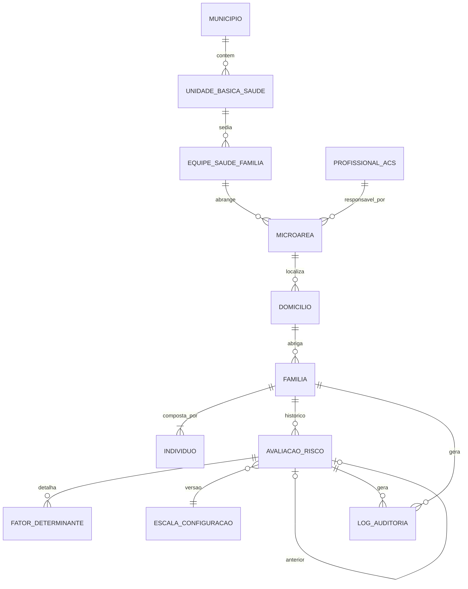

# Modelo de Domínio — PET-Saúde

Modelo conceitual das entidades e invariantes do sistema de estratificação de risco na APS. A implementação de referência está em `shared/domain/schemas/index.ts` (Zod) e `firestore.rules` (acesso e persistência).

---

## 1. Entidades e relacionamentos

### 1.1. Campos territoriais denormalizados

`Domicilio`, `Familia`, `Individuo` e `AvaliacaoRisco` carregam **`municipioId`, `equipeId` e `microareaId`**. Isso permite que `firestore.rules` verifique o território de cada documento sem consultas extras, e que as listagens filtrem pelo território do profissional. Os três campos só podem mudar em transferência territorial pela coordenação (ver invariante 3); o endpoint de transferência ainda não está implementado.

---

## 2. Dicionário de entidades

### 2.1. `UnidadeBasicaSaude` (UBS)

Estabelecimento do SUS onde as equipes estão alocadas. Identificadores: ID, código CNES, nome, município (Coxim ou Corumbá).

### 2.2. `EquipeSaudeFamilia` (eSF)

Equipe multiprofissional (medicina, enfermagem, técnico de enfermagem, odontologia, ACS) com território adscrito. Identificadores: ID, código INE, nome, UBS de referência.

### 2.3. `Microarea` — schema `MicroareaSchema`

Subdivisão territorial sob responsabilidade de um ACS.

- **Atributos:** `id`, `numero`, `descricao` (opcional), `acsId` (opcional), `equipeId`, `municipioId`.

### 2.4. `Domicilio` — schema `DomicilioSchema`

Edificação e suas condições de infraestrutura.

- **Atributos:** endereço (`logradouro`, `numero`, `bairro`, `cep` opcional), território, `quantidadeComodos`, `quantidadeMoradores`, abastecimento de água, esgotamento sanitário, destino do lixo, `saneamentoInadequado`, `adensamentoExcessivo`.

### 2.5. `Familia` — schema `FamiliaSchema`

Núcleo familiar coabitante no domicílio.

- **Atributos:** `prontuarioFamiliar`, `domicilioId`, território, `responsavelNome`, `responsavelId`, `contato` (opcional — previsto no Relatório Técnico), `status` (`ATIVA`, `MUDOU_SE`, `DESMEMBRADA`), `quantidadeMembros`, resumo da última avaliação (`ultimaClassificacaoRisco`, `ultimaPontuacaoRisco`, `dataUltimaAvaliacao`, `ultimaAvaliacaoId`).
- **Invariante:** exatamente um Responsável Familiar ativo.
- O resumo da última avaliação é uma **cópia de conveniência** para o painel; a fonte da verdade é o histórico em `AvaliacaoRisco`. Uma família nasce com resumo R0 / 0 pontos, e o resumo só muda **na mesma transação do servidor** que cria a avaliação apontada por `ultimaAvaliacaoId`, com valores idênticos (validado em `functions/src/avaliacoes.ts`; escrita cliente negada em `firestore.rules`).

### 2.6. `Individuo` — schema `IndividuoSchema`

Pessoa que compõe a família.

- **Atributos:** `nome`, `familiaId`, território, `dataNascimento`, `sexo`, `parentesco`, `cns` e `cpf` (**opcionais** — o Relatório Técnico não os exige; minimização LGPD), marcadores clínicos (`condicoesCronicas`).

### 2.7. `AvaliacaoRisco` — schema `AvaliacaoRiscoSchema`

Registro **imutável** de uma estratificação.

- **Atributos:** `familiaId`, território, `avaliadorId`, `avaliadorNome`, `avaliadorPerfil`, `dataAvaliacao`, `versaoEscala`, `pontuacaoTotal`, `classificacao`, `regraDecisao`, `fatoresDeterminantes` (cada um com código, descrição, pontos, tipo de sentinela e `individuoId` opcional), `indicadoresNaoPontuados` (opcional), `comparativoAvaliacaoAnterior` (delta, opcional).
- Persistido com `registradoEm` = horário do servidor.
- O **nome** do membro afetado não é gravado na avaliação; a interface resolve pelo `individuoId` quando o profissional tem acesso ao prontuário.

### 2.8. `LogAuditoria` — schema `LogAuditoriaSchema`

Registro **append-only** de criação, alteração ou exclusão lógica de `Familia`, `Individuo`, `Domicilio`, `Microarea` ou `AvaliacaoRisco`, conforme [`security_privacy.md`](./security_privacy.md).

- **Atributos:** `usuarioId`, `perfil`, `municipioId`, `acao`, `recursoTipo`, `recursoId` (anônimo/hasheado), `dataHora` (ISO 8601 com fuso), `justificativa` (opcional).
- **Invariante:** nunca contém nome, CPF, CNS ou condição de saúde.

---

## 3. Invariantes do domínio

1. **Imutabilidade das avaliações:** `AvaliacaoRisco` nunca sofre update nem delete. Retificação ⇒ nova avaliação, que referencia a anterior no delta.
2. **Explicabilidade:** uma `AvaliacaoRisco` é inválida se a soma dos pontos de `fatoresDeterminantes` for diferente de `pontuacaoTotal` (validado pelo `.refine` do Zod; as regras do Firestore não conseguem iterar listas, por isso a revalidação no servidor está planejada em `functions/`).
3. **Isolamento territorial:** família e domicílio pertencem a uma microárea e a uma equipe por vez. Transferência só pela coordenação, com registro em `LogAuditoria`; endpoint ainda pendente.
4. **Auditoria append-only:** toda criação, alteração ou exclusão lógica deve gerar um `LogAuditoria`, que nunca é atualizado ou apagado. Implementado para avaliação e gestão de vínculos; demais mutações ainda dependem de endpoints.
5. **Sem exclusão física:** famílias, domicílios e indivíduos são inativados por `status`, nunca apagados.

---

## 4. Documentação relacionada

- Pontuação e faixas: [`business_rules.md`](./business_rules.md)
- Camadas e fluxo da avaliação: [`architecture.md`](./architecture.md)
- Proteção de dados e RBAC: [`security_privacy.md`](./security_privacy.md)
- Apresentação da classificação: [`ui_guidelines.md`](./ui_guidelines.md)

## 5. Contratos operacionais implementados localmente

O namespace canônico é `tenants/{municipioId}/...`. Caminhos legados na raiz e escrita cliente são negados. Os painéis demonstrativos mantêm fixtures em memória; nenhum dado remoto foi migrado.

- `TenantSchema`: município e nome; documento de metadados, sem saúde.
- `vinculoSchema` e `claimsAcessoSchema`: UID no vínculo, município/tenant iguais, perfil existente, equipe/microáreas, status ATIVO/INATIVO e versão de acesso. Backend administra; regras consultam vínculo ativo para bloquear tokens de versão anterior.
- `FamiliaVersionadaSchema`: família existente mais `versaoCadastro` não negativa. Legado sintético assume zero; futuros endpoints de cadastro devem incrementar versão para detectar conflitos.
- `OperacaoAvaliacaoSchema`: ID UUID estável, município, família, versão base do cadastro, avaliação anterior, escala, coleta e 13 respostas explícitas únicas. Não aceita pontuação fornecida pelo cliente. Rascunhos locais podem ser incompletos e não produzem classificação.
- `AvaliacaoCanonicaSchema`: contrato de avaliação existente (incluindo soma dos fatores), respostas completas e ID da operação. `registradoEm` é acrescentado pelo servidor.
- `ReciboOperacaoSchema`: CONFIRMADA exige ID da avaliação; CONFLITO exige motivo. Ambos incluem ID da operação e horário do servidor.
- `RegistroOperacaoSchema`: UID, município, hash do conteúdo e recibo; conflito preserva a operação original para revisão. O ID do documento deriva de UID/tenant/ID da operação. Escrita e leitura cliente são negadas.
- `LogAcessoSchema`: aprovação/revogação de vínculo, somente IDs, perfil ADMIN, ação e horário; não contém nome, e-mail ou condições clínicas. Complementa `LogAuditoriaSchema` das avaliações.

Histórico e resumo são gravados junto ao recibo e à auditoria na transação. Mesma operação/conteúdo devolve recibo anterior; conteúdo diferente com mesmo ID é rejeitado. Vínculo e território são revalidados mesmo no reenvio. Cadastro ou base clínica alterada preserva conflito sem sobrescrever histórico.

## Incremento online: cadastro, transferência e conflitos

O cadastro inicial cria domicílio, um responsável e família em transação, com recibo idempotente em `operacoes_cadastro` e logs por recurso. Não cria avaliação; o resumo inicial do contrato deve aparecer como **Sem avaliação**. Atualizações cadastrais neste incremento limitam-se a prontuário, contato e status. Gestão completa de membros e edição do domicílio permanecem pendentes.

Transferências exigem coordenação da APS no mesmo município, versão atual, destino cadastrado e domicílio não compartilhado; atualizam família, domicílio e até 50 membros atomicamente. Avaliações anteriores conservam território e conteúdo originais. A equipe de destino não recebe acesso automático ao histórico do território anterior.

A consulta de conflitos ocorre por callable, somente para o autor com vínculo e território atuais. A revisão compara os 13 indicadores e exige nova confirmação, gerando outro identificador; a operação original permanece imutável. Recibos e operações não são legíveis diretamente pelo cliente. Paginação de famílias preserva filtros territoriais em cada página. Nenhum dado clínico deste incremento é persistido offline no navegador.
