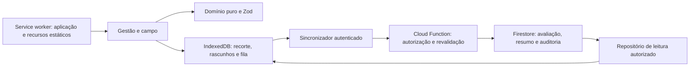

# Plano de evolução — gestão web, campo offline e multi-tenant

Data: 26/09/2026. Status: proposta para implementação incremental.

## Andamento da implementação

Atualização de 26/09/2026: frentes de identidade, persistência e campo desenvolvidas em paralelo e integradas localmente. Este plano **não está integralmente concluído** e o sistema não está liberado para uso assistencial.

| Etapa | Entrega local | Pendência de saída |
| --- | --- | --- |
| 0 | Spike PWA com Nuxt 4.5.2 e @vite-pwa/nuxt 1.1.1; build e navegação offline em Chromium | Homologação dos dispositivos; governança municipal e política offline |
| 1 | Temas, sol forte, navegação Visitas/Famílias/Sincronização/Mais, gestão e formulários acessíveis por teclado | Revisão completa WCAG, zoom/leitor de tela e tarefas com profissionais |
| 2 | Login, consulta/seleção de vínculos, gestão administrativa, claims versionadas, isolamento por caminho e revogação online via vínculo | Bootstrap institucional, configuração/publicação por ambiente e política de tenant único entre abas |
| 3 | Consulta territorial paginada, cadastro inicial, transferência municipal, avaliação recalculada, histórico/recibo/auditoria transacionais e revisão explícita de conflitos | Gestão completa de membros/domicílios, homologação e publicação por ambiente |
| 4 | PWA, IndexedDB e rascunhos de **dados sintéticos**, fila testada com adaptador injetável, retomada offline e descarte confirmado | Preparação de dados clínicos autorizados, expiração/proteção local, integração da fila à sessão real, envio automático e integração da revisão online à fila local |
| 5 | [Roteiro de piloto](./roteiro_piloto.md), contas/famílias fictícias e seed de emuladores | Piloto não executado; pesos/cortes e políticas ainda exigem validação |
| 6 | Mantida como evolução futura | Novos atores e agregações dependem de aprovação; nenhuma nova permissão foi inventada |

Rotas: `/login`, `/administracao`, `/operacional`, `/cadastro`, `/transferencia` e `/conflitos` atendem a frente institucional online. `/visitas`, `/visitas/[id]` e `/sincronizacao` atendem à prova offline com fixtures fictícias. Os painéis anteriores continuam demonstrativos. As duas experiências não compartilham dados clínicos nem autoria.

As regras agora negam todos os caminhos legados na raiz e todas as escritas cliente. O namespace operacional é `tenants/{municipioId}/...`. O servidor valida o vínculo na transação de avaliação; as regras comparam claims e versão do vínculo para bloquear revogação. Isto é uma mudança de contrato local, não uma migração de dados remotos. Nenhum deploy foi executado.

Demonstração offline: 13 respostas explícitas, sem pré-preencher negativas; rascunho incompleto não produz classificação. Uma avaliação só é confirmada com recibo válido. A fila demonstrativa não envia ao servidor nem fabrica confirmação. A área institucional realiza envio online e exibe o histórico confirmado.

A aplicação usa shell SPA (`ssr: false`), prerender da raiz e precache dos assets do build. O service worker não armazena respostas clínicas/autenticação e não força atualização com formulário aberto. Configuração pública Firebase deve ser definida no build do ambiente, inclusive no shell prerenderizado; alterar somente variáveis do servidor não atualiza o shell já instalado.

Validação final registrada: **116 testes unitários, 39 testes de regras e 22 testes de backend passaram**; typecheck, build web e lint/build Functions também passaram. Smoke integrado Auth/Functions/Firestore comprovou aprovação, revogação, reativação, bloqueio de token antigo, conflito de versão administrativa e três logs para três mutações. Navegador Chromium a 390×844: sem overflow nos fluxos de campo, rascunho recuperado após fechamento/reabertura de aba offline, rota inédita offline e coleta permanecendo pendente. Área institucional com emuladores: login fictício, consulta territorial, envio confirmado e histórico atualizado. Incremento de cadastro: ACS criou família fictícia com resposta explícita e indicação “Sem avaliação”; coordenação transferiu família no mesmo município; revisão dos 13 indicadores produziu nova avaliação confirmada, mantendo conflito original. Cadastro e revisão sem overflow em 390 px. A integração também corrigiu cópia indevida de campos cadastrais no construtor da avaliação e serialização do campo opcional de detalhe na callable. Não equivale a teste após desligamento do aparelho ou piloto profissional. Instruções reproduzíveis em [desenvolvimento local](./desenvolvimento_local.md).

Limitações de segurança ainda explícitas: selecionar outro município não revoga tokens de outros vínculos ativos; nenhuma política de armazenamento clínico offline foi presumida; não há criptografia local com gestão institucional de chaves. O uso assistencial depende também das pendências clínicas em `business_rules.md`.

## 1. Direção do produto

Uma aplicação Nuxt com duas experiências, compartilhando domínio, componentes e controle de acesso:

- **Gestão:** interface ampla, projetada para monitores 16:9, com navegação lateral, cabeçalho persistente, filtros territoriais, tabelas e painéis.
- **Campo:** PWA mobile-first para preparar visitas, consultar o recorte autorizado, coletar dados e registrar avaliações sem conexão após preparação online.
- **Gestão no celular:** evolução da mesma aplicação responsiva. Modo de interface não concede permissão; um gestor pode usar celular e um ACS pode usar desktop.

Recomendação inicial: tenant por município; Google institucional `@ufms.br` com liberação de vínculo; Firestore como persistência remota e IndexedDB para trabalho local. Não adicionar Realtime Database como ponte.

## 2. Diagnóstico do UX atual

| Evidência no código | Impacto | Alteração planejada |
| --- | --- | --- |
| `layouts/default.vue` já usa sidebar, mas apenas cabeçalho mobile; `AppHeader.vue` existe separado | Contexto e ações globais ficam dispersos no desktop | Integrar um cabeçalho único de gestão |
| Conteúdo limitado a `max-w-6xl`, rodapé institucional alto e títulos volumosos | Menos espaço útil para tabelas, especialmente em 1366×768 | Layout fluido, rodapé discreto e hierarquia mais compacta |
| Cores `bg-white`, `text-slate-*` e fundos escuros fixos em vários componentes | Tema escuro parcial pode produzir combinações ilegíveis | Tokens semânticos compartilhados por todos os temas |
| Modo sol forte sobrescreve classes específicas com `!important` | Novos componentes podem escapar do modo de contraste | Aplicar o modo pelos mesmos tokens do tema |
| Navegação mobile replica painel, famílias, território e auditoria | A coleta em campo concorre com funções administrativas | Navegação orientada a visitas, famílias e sincronização |
| Seletores oferecem os dois municípios e “Todos”; avaliador é demonstrativo | Filtro visual ainda não representa autorização | Separar tenant ativo de filtros e usar vínculos reais |
| Auditoria usa registros sintéticos e apresenta “Conformidade Estrita” | Interface pode sugerir garantia não demonstrada | Identificar ambiente demonstrativo e apresentar eventos verificáveis |
| Firebase inicializado, famílias em memória, sem PWA configurada | Fechar/recarregar pode perder o trabalho | Persistência local, recuperação e confirmação remota explícitas |
| Badge centraliza cor, ícone e texto; drawer e layout de campo já existem | Boa base para evolução | Preservar explicabilidade e adaptar aos temas |

Não tratar este diagnóstico como teste de usabilidade concluído. Realizar sessões com ACS e coordenação, com tarefas reais simuladas e dados sintéticos.

## 3. Experiência de gestão web

### Estrutura de tela

16:9 é referência de desenho, não uma proporção CSS obrigatória. Validar em 1366×768, 1600×900 e 1920×1080, mantendo funcionamento em outras proporções, zoom e tablets.

```text
┌──────────────────┬─────────────────────────────────────────────────┐
│ PET-Saúde        │ Município ativo · UBS/equipe   Tema · Conta      │
│                  ├─────────────────────────────────────────────────┤
│ Visão geral      │ Caminho da página                               │
│ Famílias         │ Título + descrição curta          Ação principal│
│ Visitas          │ Filtros aplicados + limpar                      │
│ Território       │                                                 │
│ Equipes          │ Indicadores / tabela / conteúdo                 │
│ Indicadores      │                                                 │
│ Administração*   │ Paginação · atualização dos dados               │
└──────────────────┴─────────────────────────────────────────────────┘
* Itens conforme autorização.
```

- Sidebar sugerida de 240–264 px, recolhível; drawer em telas intermediárias. Evitar mudança automática para layout de gestão apenas por ultrapassar 768 px.
- Cabeçalho de aproximadamente 64 px com tenant ativo visível, escopo territorial, situação de conexão, seletor Sistema/Claro/Escuro e conta.
- Filtro de UBS/equipe/microárea subordinado ao tenant e ao acesso. Nunca oferecer “Todos os municípios” no prontuário operacional.
- Título único por página; ação principal previsível; filtros persistidos por usuário e tenant, sem dados pessoais em URLs.
- Conteúdo fluido em tabelas; largura de leitura limitada em formulários. Rolagem horizontal apenas na tabela quando necessária.
- Tabelas com ordenação identificável, paginação remota, cabeçalho fixo quando útil, estados vazio/erro/carregando e colunas ajustáveis.
- Menu e rotas respeitam permissões; backend e regras continuam sendo a barreira de segurança.

### Revisão por página

| Página | Experiência proposta |
| --- | --- |
| Visão geral | Resumo territorial, distribuição por faixa, pendências operacionais e lista priorizada; data de atualização e cobertura dos dados visíveis |
| Famílias | Busca por identificador permitido, responsável abreviado, filtros, última avaliação e ação de abrir/reavaliar; sem condições clínicas expostas na listagem |
| Prontuário familiar | Resumo, membros e domicílio, histórico e avaliações; badge abre explicação em um clique |
| Território | Hierarquia Município → UBS → equipe → microárea; distinguir navegação, filtro e transferência territorial |
| Visitas, nova | Lista planejada, iniciada e concluída; distinguir visita realizada de avaliação já confirmada no servidor |
| Equipes e acessos, nova | Vínculos, convites, escopo e inativação; poderes administrativos separados dos clínicos |
| Auditoria | Priorizar eventos e filtros por período, ação, ator e recurso; detalhe lateral; retirar afirmações de conformidade absoluta |
| Indicadores acadêmicos, futura | Agregações autorizadas; sem prontuários nem detalhamento que permita reidentificação |

Gráficos devem ter alternativa tabular, rótulos e legenda; dados sem avaliação não devem ser visualmente apresentados como evidência de ausência de risco.

## 4. Identidade visual e temas

Proposta estética para saúde pública: azul-petróleo nas ações, superfícies neutras e pouca saturação fora dos estados de risco. É uma escolha de design, não um padrão clínico obrigatório ou uma identidade oficial da UFMS.

| Token / função | Claro | Escuro |
| --- | --- | --- |
| Fundo da aplicação | `#F8FAFC` | `#0F172A` |
| Superfície de cards e tabelas | `#FFFFFF` | `#1E293B` |
| Texto principal | `#0F172A` | `#F8FAFC` |
| Texto secundário | `#475569` | `#CBD5E1` |
| Borda decorativa | `#CBD5E1` | `#475569` |
| Ação primária | `#0E7490` com texto branco | `#67E8F9` com texto `#0F172A` |
| Foco | `#1D4ED8` | `#67E8F9` |

Os pares são candidatos: medir contraste no componente renderizado, incluindo hover, disabled, seleção, gráficos e inputs. Bordas necessárias para identificar controles precisam de contraste próprio, diferente de separadores decorativos.

- Manter R0 verde, R1 âmbar, R2 laranja e R3 vermelho conforme `ui_guidelines.md`; variações claras/escuras ficam em `estiloFaixaRisco.ts`.
- Diferenciar estados de sincronização de faixas clínicas por ícone e texto. “Sincronizado” não significa “sem risco”.
- Centralizar tokens em `main.css` e integração Nuxt UI em `app/app.config.ts`. Remover cores fixas progressivamente.
- Sistema/Claro/Escuro com preferência persistida e aplicação inicial sem flash de tema; gráficos e overlays acompanham a preferência.
- Sol forte é uma preferência de leitura adicional: superfície branca, texto escuro, bordas fortes, sem transparências; ao sair, restaurar o tema anterior.
- Texto operacional preferencialmente 14–16 px; evitar os atuais 9–11 px em informações necessárias para a tarefa. Alvos de toque de pelo menos 44×44 px como meta do projeto.
- Validar teclado, foco, leitores de tela, zoom de 200%, daltonismo e contraste AA. Manter coleções e mapas de ícones existentes.

### 4.1. Configuração obrigatória conforme Nuxt UI v4

Revisão adicional solicitada: usar a documentação oficial da **v4** e conferir os contratos da versão instalada, **`@nuxt/ui 4.11.2`**, verificada em `node_modules/@nuxt/ui/package.json`. Não transpor exemplos da v3 ou de versões anteriores por memória. O restante do plano permanece mantido.

A orientação oficial distingue configuração global, variantes e customização por slots [6]. Para cada componente alterado, conferir também os tipos e a implementação em `node_modules/@nuxt/ui/dist/runtime/components/` e o tema gerado em `.nuxt/ui/`. Esses arquivos são referência de leitura; não devem ser editados.

**Organização do tema:**

1. `app.config.ts → ui.colors`: associar nomes semânticos às paletas. `color="primary"` seleciona o papel semântico; não passar hexadecimal como `color`.
2. `main.css`: definir tokens e tons por modo. Uma paleta própria deve ter escala completa em `@theme`; os hexadecimais da tabela anterior são referências visuais, não substituem a configuração do tema.
3. `app.config.ts → ui.<componente>`: configurar padrões compartilhados usando os slots, variantes e `defaultVariants` realmente disponíveis.
4. Prop `ui`: ajustar slots de uma instância, com nomes específicos de cada componente. Não usar um objeto de slots genérico para todos os componentes.
5. Prop `class`: ajustes do elemento exposto pelo componente; em componentes com portal, conferir onde é aplicada e preferir `ui.content` para o painel.

Exemplo proposto de configuração, a aplicar na etapa visual:

```ts
export default defineAppConfig({
  ui: {
    colors: {
      primary: 'cyan',
      secondary: 'blue',
      success: 'green',
      info: 'sky',
      warning: 'amber',
      error: 'red',
      neutral: 'slate'
    },
    card: {
      slots: {
        root: 'rounded-xl',
        body: 'p-4 sm:p-6'
      }
    }
  }
})
```

```css
/* Após os imports já existentes. */
:root {
  --ui-primary: var(--ui-color-primary-700);
}

.dark {
  --ui-primary: var(--ui-color-primary-200);
}
```

```vue
<UCard :ui="{ header: 'bg-muted', body: 'space-y-4' }">
  <p class="text-default">Conteúdo</p>
  <UButton color="primary" variant="solid" label="Salvar" />
</UCard>
```

Preferir `bg-default`, `bg-elevated`, `text-default`, `text-muted` e `border-default` nas superfícies operacionais. Os estilos clínicos continuam no mapa de risco, com variantes próprias de tema. O objeto global usa `slots`; a prop local usa diretamente as chaves dos slots (`:ui="{ body: '...' }"`, não `:ui="{ slots: ... }"`).

### 4.2. Inventário de contratos e achados da versão instalada

| Componente | Contrato a respeitar na v4 / revisão planejada |
| --- | --- |
| `UBadge` | Slot principal `base`, além de `label` e slots de ícones/avatar. `as`, `color`, `variant` e `size` existem. O `ui.base` atual é válido. `subtle` também gera `ring`; revisar fundo, texto e anel juntos para não misturar cor primária com cor clínica. O conteúdo manual do slot padrão não é estilizado automaticamente por `ui.label`. Para `as="button"`, declarar `type="button"`. |
| `UCard` | Slots `root`, `header`, `title`, `description`, `body`, `footer` na versão instalada. As chaves `root`/`body` atuais são válidas; substituir os fundos brancos fixos. Verificar classes responsivas padrão: `p-0` não necessariamente remove `sm:p-6`; quando necessário, explicitar `p-0 sm:p-0`. |
| `UProgress` | **Erro identificado em `app/pages/territorio/index.vue`:** usa `:value="ind.percentual"`. Planejar correção para `:model-value="ind.percentual" :max="100"`; a implementação instalada inicia `modelValue` como `null`, estado indeterminado. |
| `USelect` | Conferir `items`, `v-model`, `value-key`, `label-key` e tipos dos valores na API instalada. A configuração atual com `items` e `value-key="value"` deve ser preservada quando corresponder ao formato dos itens; não trocar por parâmetros de exemplos antigos. |
| `UTable` | Manter `data`, `columns` e slots de célula da API atual; tipar colunas com `TableColumn<T>`. Usar `accessorKey` para campos existentes e `id` para colunas de apresentação, como ações ou recurso composto. Revisar as colunas atuais `acoes` e `recurso`. |
| `UModal` / `USlideover` | `v-model:open` está alinhado à implementação instalada. Customizar painel por `ui.content`. Conferir `title`, `description`, slots, fechamento e foco; substituir `#content`/`#header` não dispensa nome acessível. O modal atual sem título e o cabeçalho manual do drawer precisam dessa revisão. |
| `UTabs` | Conferir itens, valores, slots nomeados e modelo. O tema instalado possui `list`, `trigger` e `indicator`; ajustar só `trigger` pode competir com o indicador ativo. |
| `UButton`, `UInput`, `UAlert`, `UBreadcrumb` | Conferir individualmente tipos exportados, props, eventos e slots antes de mudar; não assumir que os mesmos `variant`, `size` ou slots existem em todos. |
| `UApp` | Já envolve a aplicação. Preservar a integração e validar overlays e temas dentro dessa estrutura. |

Esta é uma conferência documental e de código; não é uma certificação visual de todos os componentes. Os achados entram como trabalho explícito da etapa 1.

### 4.3. Critério de aceite específico para Nuxt UI

- Registrar versão e referência da API usada em cada mudança de componente; conferir atualizações contra a versão efetivamente instalada.
- Revisar props, eventos, valores de `v-model`, slots de conteúdo e slots de tema de todos os componentes utilizados nas páginas afetadas.
- Fazer checagem de tipos (`nuxt typecheck`, com ferramenta configurada no projeto) além do build; build isolado não garante validade de todas as props.
- Validar estilos computados em claro, escuro e sol forte, incluindo `ring`, bordas, foco, hover e breakpoints. Classes locais se combinam com o tema, não eliminam automaticamente todos os estilos anteriores.
- Verificar progresso com 0, valor intermediário e 100; selects refletindo o valor; tabelas renderizando e ordenando corretamente; abas alternando conteúdo; overlays com nome acessível e retorno de foco.
- Não introduzir upgrade de biblioteca como parte desta revisão sem necessidade demonstrada.

## 5. Multi-tenant e atores

### Limite do tenant

Proposta: cada município é um tenant operacional (`coxim`, `corumba`). UBS, equipes e microáreas são subdivisões. A UFMS participa por vínculos e visões acadêmicas autorizadas; não recebe acesso global automático aos prontuários.

Um Firebase por ambiente, inicialmente com isolamento lógico por tenant. Projetos separados por município ficam como alternativa caso requisitos institucionais exijam separação física. Multi-tenancy de dados não exige, por si só, tenants de autenticação do Identity Platform.

### Matriz inicial de atores

| Ator | Escopo | Capacidades propostas | Situação |
| --- | --- | --- | --- |
| ACS | Microáreas atribuídas da equipe | Preparar visitas, cadastro autorizado, coleta e avaliação | Perfil existente |
| Enfermagem, medicina, técnico de enfermagem e odontologia | Equipe | Consultar e registrar conforme RBAC atual | Perfis existentes |
| Coordenador APS | Município | Gestão territorial e do cuidado, transferência territorial | Perfil existente |
| Administrador técnico | Escopo administrativo autorizado | Configuração territorial e auditoria sem dados clínicos | Preservar restrição de `ADMIN` |
| Gestor de UBS | Equipes da UBS | Indicadores e organização do trabalho; acesso clínico separado | Novo, validar |
| Coordenador PET/UFMS | Municípios conveniados | Indicadores agregados e acompanhamento do projeto | Novo, sem acesso clínico padrão |
| Preceptor/tutor | Equipe e vínculo explícito | Supervisão; eventual acesso clínico depende de autorização específica | Novo, validar |
| Estudante/bolsista | Atividades supervisionadas | Inicialmente ambiente sintético; acesso real e coautoria fora do MVP | Futuro |
| Auditor/encarregado | Escopo concedido | Eventos e metadados sem condições de saúde | Novo, validar |

Não criar um “superadmin” que leia dados de saúde. Ocupação, função acadêmica e permissão são conceitos distintos. Novos atores não devem ser adicionados ao enum de perfis antes de revisar a matriz com os responsáveis.

### Contratos e isolamento

- Introduzir `Tenant`, `VinculoUsuarioTenant`, `ConviteAcesso` e, quando implementados, `Visita` e `OperacaoSincronizacao`. Toda entidade persistida terá Zod, política de acesso, testes e ciclo de vida.
- Propor documentos operacionais em `tenants/{tenantId}/...`; manter território denormalizado e validar consistência entre caminho, documento, vínculos e referências.
- Acrescentar `tenantId` ao contexto de autorização; no MVP cada tenant corresponde a exatamente um município. Nunca aceitar IDs de outro tenant em relacionamentos.
- Continuar usando custom claims emitidas pelo backend para perfil e escopo ativo. Documentos de vínculo são geridos pelo backend; o cliente não concede acesso editando documentos.
- Vínculos múltiplos são selecionados online por endpoint autorizado, que emite o escopo ativo. Não colocar listas ilimitadas de municípios/equipes no token: custom claims têm limite de 1000 bytes [3].
- Troca de tenant exige renovar token, encerrar listeners, limpar estado em memória e segregar cache. Mudança de escopo deve coordenar abas; para o MVP, um tenant ativo por sessão de navegador.
- Backend verifica vínculo vigente e versão de autorização nas mutações; planejar regras que também invalidem escopos revogados. Claim antiga não pode manter acesso online indefinidamente.
- Admin SDK ignora Security Rules: todas as funções validam identidade, tenant, perfil, território e referências explicitamente.
- Agregação entre municípios é um produto separado produzido pelo backend, com minimização e proteção contra reidentificação em grupos pequenos; critérios precisam de definição institucional.
- Transferências entre tenants ficam fora do MVP. Transferência dentro do município é online e auditada; avaliações históricas mantêm seu contexto, sem reescrita.

## 6. Login Google `@ufms.br`

Fluxo: Entrar com Google → validar identidade institucional no backend → localizar vínculo aprovado → selecionar tenant autorizado → carregar escopo e área de trabalho.

- Usar Firebase Authentication com provedor Google. O parâmetro `hd=ufms.br` melhora a seleção de conta, mas não é controle de acesso [4].
- Backend valida token Firebase, provedor Google, e-mail verificado e domínio exato `ufms.br`; rejeitar outros domínios e subdomínios não autorizados.
- Se a exigência incluir pertencimento ao Google Workspace institucional, validar também o `hd` no ID token Google, com assinatura, emissor, audiência e validade corretos. Não presumir que o token Firebase contém esse atributo.
- Login válido sem vínculo apresenta “Acesso pendente”; não libera consultas. Somente o backend atribui claims após aprovação administrativa.
- Prever conta errada, popup bloqueado, sessão expirada, vínculo inativo e usuário com múltiplos vínculos. Testar fluxo de redirect conforme ambiente de hospedagem.
- Primeiro login, nova liberação de acesso e troca de tenant precisam de conexão. Continuidade offline usa sessão previamente preparada, com política de validade definida para o dispositivo.
- Restrição exclusivamente `@ufms.br` pode excluir ACS e profissionais municipais sem conta institucional. Manter a exigência solicitada no MVP e registrar provisionamento dessas contas como dependência; não abrir exceção silenciosamente.

## 7. Campo mobile-first e offline

### Navegação e jornada

Barra inferior: **Visitas · Famílias · Sincronização · Mais**. Cabeçalho compacto com território, conexão e modo sol forte. Auditoria e administração ficam disponíveis somente a quem tiver permissão, fora do caminho principal de coleta.

1. **Preparar saída, online:** selecionar famílias autorizadas; baixar dados mínimos e versão da escala; conferir itens disponíveis e última atualização.
2. **Em campo:** abrir família preparada, iniciar visita, preencher grupos curtos, consultar explicação e salvar localmente.
3. **Confirmar no dispositivo:** mostrar “Salvo neste aparelho — aguardando envio”. Rascunho e avaliação submetida são estados distintos.
4. **Retomar:** reabrir a PWA após encerramento e recuperar dados e fila persistidos.
5. **Sincronizar:** enviar pendências, validar no servidor e apresentar confirmadas, conflitos ou erros com ação de recuperação.

Formulário com progresso por grupos, salvamento de rascunho, resumo antes de concluir e ação principal alcançável pelo polegar. Evitar perda ao voltar, atualizar a aplicação ou receber ligação.

**Decisão de integridade implementada:** `ui_guidelines.md` foi atualizado para exigir respostas explícitas. Campos sem resposta permanecem incompletos e não geram classificação; nenhum peso ou corte foi alterado. O modelo também inicializa resumo R0 para família nova: a interface deve distinguir “Sem avaliação” usando a existência de avaliação, e a revisão do contrato deve ser explícita.

### Arquitetura recomendada



Firestore oferece cache persistente e sincronização offline, mas alterações concorrentes no mesmo documento seguem a última gravação [1]. Realtime Database Web não persiste dados offline além da sessão [2]. Para esta aplicação, a proposta é uma fila explícita em IndexedDB e um único fluxo de escrita canônica pelo backend; não duas filas independentes tentando confirmar a mesma avaliação.

- Service worker guarda aplicação, ícones e recursos necessários. Não armazenar respostas clínicas ou autenticação em cache HTTP genérico.
- IndexedDB guarda recorte mínimo, rascunhos e operações por `uid + tenantId`. Dados remotos entram pelo repositório, com versão e data de atualização.
- Inicialmente, cache de leitura do SDK em memória para evitar outra cópia clínica persistente sem gestão. Se for habilitado cache persistente Firestore, documentar sua limpeza e segregação, sem duplicar a autoridade da fila.
- Selecionar módulo PWA apenas após comprovar compatibilidade com Nuxt 4. `@vite-pwa/nuxt` é candidato; a página consultada é intitulada Nuxt 3 e não basta como comprovação [5]. Fazer spike de build, instalação, rotas offline e atualização com as versões do repositório.
- Rota ainda não visitada deve abrir offline pela aplicação previamente instalada; família não preparada mostra indisponibilidade, sem fingir lista vazia.
- Atualização do service worker não pode recarregar um formulário com alterações ou quebrar a versão da fila; prever migração e adiamento da atualização.

### Confirmação e concorrência

Cada operação inclui ID estável, tenant, família, versão base, versão da escala, respostas e horário de coleta. A identidade enviada pelo cliente é conferida; o backend obtém autoria da autenticação.

O servidor revalida acesso e Zod, recalcula pelo motor e registra avaliação append-only, resumo da família, recibo da operação e log em transação. Reenvio com mesmo ID retorna o recibo anterior; mesmo ID com conteúdo diferente é rejeitado. Usar horário do servidor para confirmação e ordenação, preservando o horário informado da coleta.

Estados: `rascunho → pendente → enviando → confirmado`, com alternativas `conflito`, `rejeitado` e `requer_login`. Reinício durante envio permite reenvio idempotente. “Confirmado” exige recibo do backend.

Se a avaliação anterior ou versão do cadastro mudou, não sobrescrever silenciosamente: preservar a operação local e apresentar comparação para revisão autorizada. O delta mantém referência explícita à avaliação base. Duas avaliações offline da mesma família precisam de encadeamento e envio ordenado; conflitos interrompem apenas a sequência afetada. Escala desatualizada não é substituída silenciosamente por outra versão.

### Conexão, Wi-Fi e limites

- Sincronizar ao abrir/retomar o app, ao recuperar conectividade e por botão. Repetir falhas transitórias com espera progressiva; erros de permissão não entram em repetição infinita.
- Navegadores não oferecem detecção universal confiável de Wi-Fi. Oferecer envio automático com conexão ou envio manual, sem prometer “somente Wi-Fi” quando não for verificável.
- Execução em segundo plano varia por navegador e sistema; o fluxo garantido deve funcionar com a PWA aberta. Primeiro acesso sem internet não é suportado.
- Tratar quota excedida, indisponibilidade de IndexedDB e remoção de armazenamento pelo navegador. Solicitar persistência quando suportada e só anunciar salvamento após confirmação local.
- Definir política institucional de dispositivo confiável, bloqueio, criptografia local e gestão de chaves, tempo máximo offline e retenção. IndexedDB, sozinho, não equivale a proteção dos dados no aparelho.
- Revogação remota não apaga imediatamente um dispositivo desconectado. Expiração local reduz a exposição, mas não substitui controles do aparelho; testar reconexão com acesso revogado.
- Logout/troca de usuário não pode expor cache anterior nem descartar silenciosamente pendências: bloquear acesso, informar pendências e exigir sincronização ou descarte explicitamente confirmado conforme política.
- Leituras offline podem gerar eventos locais para envio posterior; distinguir horário declarado do horário de recebimento. Esses eventos não comprovam toda leitura possível de um cache local.

## 8. Etapas de implementação

| Etapa | Entregas | Critério de saída |
| --- | --- | --- |
| 0 — Decisões e prova técnica | Validar tenant municipal e atores, contas UFMS, edição/localização do Firestore, dispositivos e política offline; spike PWA Nuxt 4 | Compatibilidade demonstrada e decisões registradas |
| 1 — UX e temas | Tokens, cabeçalho de gestão, sidebar, navegação de campo, revisão das páginas e temas | Tarefas concluídas nos três temas, em desktop e celular, com dados sintéticos |
| 2 — Identidade e isolamento | Login, vínculos, claims, tenant ativo, schemas, regras e testes | Conta sem vínculo e acesso cruzado negados no servidor e nas regras |
| 3 — Persistência canônica | Repositórios, funções, revalidação, transação e auditoria | Avaliação, resumo e log consistentes; repetição não duplica gravação |
| 4 — Campo offline | PWA, preparação, IndexedDB, fila, recuperação, conflitos e estado de sincronização | Visita completa após fechar/reabrir offline, seguida de confirmação única |
| 5 — Piloto controlado | Testes com profissionais e aparelhos representativos, medição de usabilidade e correções | Fluxos e controles aceitos; pendências clínicas e institucionais resolvidas antes de uso real |
| 6 — Evolução | Gestão mobile, supervisão acadêmica e agregações entre municípios | Novos atores e acessos aprovados e testados |

Dependências: etapa 1 pode avançar após decisões visuais; etapas 2 e 3 antecedem sincronização real da etapa 4. Não estimar prazo sem tamanho da equipe, disponibilidade para validação e resultado do spike offline.

### Mapa de alterações previstas

- `app/assets/css/main.css`, `app/app.config.ts`, `app/utils/estiloFaixaRisco.ts`: tokens, temas e risco acessível.
- `app/layouts/` e `app/components/ui/`: shells de gestão/campo, cabeçalho, navegação, conta e contexto territorial.
- `app/pages/`: login, acesso pendente, visitas, sincronização e administração, além da revisão das páginas existentes.
- `app/composables/`: separar sessão, tenant, filtros, tema e sincronização do atual `useFamilias`.
- `app/repositories/` e camada local a criar: contratos e adaptadores remoto/local; componentes sem chamadas diretas ao banco.
- `shared/domain/schemas/`: contratos de tenant, vínculos e coleta/sincronização; motor permanece puro, com escala vigente preservada.
- `functions/`: aprovação de acesso, troca de escopo e processamento transacional de operações.
- `firestore.rules`, índices e testes: isolamento, integridade e permissões. Escrita canônica de avaliações e logs passa a ser exclusiva do backend.
- `nuxt.config.ts`, manifesto e service worker: instalação, recursos offline e atualização segura.
- Documentos especializados de `context/`: atualizar decisões efetivamente adotadas, sem converter sugestões em regras vigentes antecipadamente.

Migração: o protótipo usa memória e regras não publicadas; criar primeiro fixtures sintéticas com tenants. Antes de qualquer migração remota, inventariar dados existentes, validar transformação, backup, rollback e referências. Nunca reescrever avaliações históricas para ajustar o novo modelo.

## 9. Verificação e aceite

- UX: desktop 16:9 nas três resoluções, celular 360/390/430 px, tablet, zoom, teclado, leitor de tela e três modos visuais. Não cortar ações nem ocultar campos com teclado virtual aberto.
- Acesso: outro domínio, ausência de vínculo, token expirado/revogado, claims manipuladas, ADMIN tentando ler prontuário, ACS fora da microárea e referência cruzada entre tenants.
- Offline: preparar online, desligar rede, cadastrar/coletar o que estiver no escopo, fechar e reabrir, retomar, reconectar, verificar recibo e única avaliação/log; repetir com falha durante resposta.
- Concorrência: duas abas/dispositivos, cadastro alterado, duas avaliações da família, escala diferente, troca de tenant, permissão revogada e fila parcialmente enviada.
- Armazenamento: quota cheia, limpeza do navegador, logout com pendências e migração de versão da PWA.
- Integridade: avaliação imutável, resumo idêntico ao evento confirmado, log sem dados sensíveis, autoria validada e delta ligado à avaliação correta.
- Executar `pnpm test` em alterações do domínio; `pnpm test:rules` quando alterar regras; `pnpm build` para integração visual/PWA. Adicionar testes de integração do backend, pois Admin SDK não passa pelas regras.
- Piloto: medir conclusão de tarefas, erros de coleta, recuperação de rascunhos e clareza de “salvo localmente” versus “confirmado”. Metas numéricas serão definidas com os usuários após a primeira rodada.

## 10. Decisões ainda necessárias

1. Confirmar município como tenant e a governança de aprovação de acessos; quem provisionará contas UFMS para profissionais municipais?
2. Confirmar quais novos atores entram no MVP; manter apenas os perfis existentes até validar permissões adicionais.
3. Definir aparelhos/navegadores suportados, uso compartilhado, proteção local, retenção e duração permitida sem autenticação online.
4. Definir escopo inicial de cadastro offline: avaliações de famílias preparadas primeiro; novas famílias e membros requerem IDs locais, dependências e reconciliação próprios.
5. Homologar o fluxo de respostas explícitas e a apresentação “Sem avaliação”; a implementação distingue coleta incompleta de resposta negativa.
6. Validar pesos, cortes e protocolos pendentes antes de uso assistencial real; este plano não valida a escala.

## Fontes técnicas consultadas

1. [Firestore: acesso offline](https://firebase.google.com/docs/firestore/manage-data/enable-offline) — cache e comportamento de concorrência.
2. [Realtime Database Web: recursos offline](https://firebase.google.com/docs/database/web/offline-capabilities) — limitações entre sessões.
3. [Firebase: custom claims](https://firebase.google.com/docs/auth/admin/custom-claims) — escopo de autorização e limite de tamanho.
4. [Google OpenID Connect](https://developers.google.com/identity/openid-connect/openid-connect) — diferença entre sugestão de domínio e validação de identidade.
5. [Vite PWA: integração Nuxt](https://vite-pwa-org.netlify.app/frameworks/nuxt) — candidato para o spike; compatibilidade Nuxt 4 ainda precisa ser demonstrada.
6. [Nuxt UI: orientação oficial de design system, branch v4](https://github.com/nuxt/ui/blob/v4/skills/nuxt-ui/references/guidelines/design-system.md) — configuração de cores e customização. Complementada pela leitura do código instalado `4.11.2` e dos temas gerados; o site principal retornou conteúdo Markdown incompatível com o leitor utilizado em algumas páginas.
